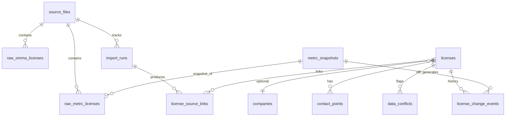

# CannaCore Database Rebuild & OMMA/Metrc Merge Plan

**Status:** Planning / audit only — no database changes, migrations, or import code yet.  
**Project:** CannaCore / ArkOne Systems (CRM repo)  
**Date:** 2026-05-28  
**Prerequisite:** Phase 0 security hardening complete; read-only inspection via `backend/scripts/inspect_source_data.py`

---

## Executive summary

CannaCore will move from a single flat `contacts` table (email-centric CRM) to a **license-centric** data model that preserves immutable raw source rows, builds merged operational records, and supports **monthly Metrc snapshot diffs**. OMMA files are **historical public snapshots**; Metrc files represent **current operational registry** (growers today; other license types later).

**Primary merge key:** normalized license number (`XXXX-XXXX-XXXX`, uppercase, no whitespace).

**Design principles:**

1. Never overwrite raw source rows — only append new imports and link to them.
2. Never silently overwrite historical OMMA values when Metrc disagrees — store both and flag conflicts.
3. Operational “current truth” for outreach eventually favors Metrc; marketing contact fields use **best available** with explicit source attribution.
4. Keep existing `Contact` / `Client` models and `app.db` behavior unchanged until a deliberate cutover phase.

---

## 1. Current source files summary

### 1.1 File inventory

| Source | Path | Sheet | Rows | Columns (detected) |
|--------|------|-------|------|---------------------|
| OMMA Grower | `data/raw/omma/OMMA - Grower Records Final Output 18-01-2026.xlsx` | `Data` | **2,448** | License No., Business Name, DBA, License Type, City, County, Expiration, Email |
| OMMA Processor | `data/raw/omma/OMMA - Processor Records Final Output 18-01-2026.xlsx` | `Data` | **765** | Same 8-column schema |
| OMMA Dispensary | `data/raw/omma/OMMA - Dispensary Records Final Output 18-01-2026.xlsx` | `Data` | **1,550** | Same 8-column schema |
| Metrc Grower | `data/raw/metrc/Master Metc List Growers.xlsx` | `Sheet1` | **5,293** | License No., Business Name, License Type, Address, Phone number |

**Total OMMA license rows (all types):** 4,763 (unique licenses across types must be deduplicated by prefix — e.g. `GAAA-`, `PAAA-`, `DAAA-` — not assumed globally unique across types).

### 1.2 Inspection results (2026-05-28)

| Metric | OMMA Grower | OMMA Processor | OMMA Dispensary | Metrc Grower |
|--------|-------------|----------------|-----------------|--------------|
| Row count | 2,448 | 765 | 1,550 | 5,293 |
| Duplicate full rows | 0 | 0 | 0 | **1,374** |
| Duplicate license rows | 0 | **4** | 0 | **998** |
| Email column | Yes | Yes | Yes | No |
| Phone column | No | No | No | Yes (`Phone number`) |
| License format (normalized) | 14-char standard | standard | standard | standard where present |

**OMMA grower vs Metrc grower (license match):**

| Metric | Count |
|--------|------:|
| Unique OMMA grower licenses | 2,448 |
| Unique Metrc grower licenses | 2,124 |
| **Matching licenses** | **2,026** |
| **OMMA-only** | **422** |
| **Metrc-only** | **98** |
| Match rate (vs OMMA) | 82.76% |
| Match rate (vs Metrc) | 95.39% |

**Additional Metrc data-quality notes:**

- ~**2,670** rows have null/empty license numbers (of 5,293) — must be quarantined, not merged on license key.
- ~**2,623** rows carry a license value; only **2,124** unique licenses — duplicate rows likely represent multiple facilities/locations per license, export artifacts, or repeated pulls—not necessarily distinct businesses.
- Phone values may arrive as Excel numeric types (scientific notation risk) — normalize to E.164 or display strings at import time.

**OMMA characteristics:**

- Snapshot dated **18-01-2026** in filenames — treat as `source_effective_date`, not “live OMMA API.”
- May include **inactive/expired** licenses still present in last published list.
- Strong for **email** and geographic fields (city, county, expiration).

**Reports (gitignored, may contain PII):** `data/reports/inspection_summary.*`, `data/reports/per_file/*`, `data/reports/omma_grower_vs_metrc_grower.*`

---

## 2. Recommended canonical schema

New tables live in a **dedicated schema namespace** (e.g. SQLite schema prefix or table prefix `cc_`) to avoid colliding with legacy `contacts` / `clients` until Phase G cutover.

### 2.1 Entity relationship overview



### 2.2 `source_files`

| Aspect | Detail |
|--------|--------|
| **Purpose** | Registry of every raw file ingested (OMMA xlsx, Metrc xlsx/csv); audit trail and checksum. |
| **PK** | `id` (UUID or integer) |
| **Important fields** | `source_system` (`omma` \| `metrc`), `license_category` (`grower` \| `processor` \| `dispensary` \| `transporter` \| …), `file_path`, `file_name`, `file_sha256`, `file_size_bytes`, `sheet_name`, `row_count`, `imported_at`, `source_effective_date` (from filename or metadata), `notes` |
| **Relationships** | Parent of `raw_omma_licenses`, `raw_metrc_licenses`, `import_runs`, `metrc_snapshots` |

### 2.3 `raw_omma_licenses`

| Aspect | Detail |
|--------|--------|
| **Purpose** | Immutable row-level copy of each OMMA spreadsheet row. |
| **PK** | `id` |
| **Important fields** | `source_file_id` (FK), `row_number`, `license_number_raw`, `license_number_normalized`, `business_name`, `dba`, `license_type`, `city`, `county`, `expiration_raw`, `expiration_date` (parsed), `email_raw`, `email_normalized`, full `raw_json` blob for forward compatibility |
| **Relationships** | FK → `source_files`; linked from `license_source_links` |

**Indexes:** `license_number_normalized`, `(source_file_id, row_number)` unique.

### 2.4 `raw_metrc_licenses`

| Aspect | Detail |
|--------|--------|
| **Purpose** | Immutable row-level copy of each Metrc export row (per snapshot). |
| **PK** | `id` |
| **Important fields** | `source_file_id` (FK), `metrc_snapshot_id` (FK, nullable for first design), `row_number`, `license_number_raw`, `license_number_normalized`, `business_name`, `license_type`, `address_raw`, `address_normalized` (parsed components later), `phone_raw`, `phone_normalized`, `raw_json` |
| **Relationships** | FK → `source_files`, `metrc_snapshots`; linked from `license_source_links` |

**Indexes:** `license_number_normalized`, `metrc_snapshot_id`, `(source_file_id, row_number)` unique.

### 2.5 `companies`

| Aspect | Detail |
|--------|--------|
| **Purpose** | Optional grouping above license when one legal entity holds multiple licenses or one DBA operates many sites. **Deferred decision** — may start as 1:1 with license. |
| **PK** | `id` |
| **Important fields** | `display_name`, `legal_name`, `primary_dba`, `confidence_score`, `created_at`, `updated_at` |
| **Relationships** | One-to-many `licenses` |

**Open design choice:** Initial merge may set `company_id` = implicit via license only; add explicit companies when ownership/transfer rules mature.

### 2.6 `licenses`

| Aspect | Detail |
|--------|--------|
| **Purpose** | Canonical merged license record — the primary business key for CannaCore. |
| **PK** | `id` |
| **Natural key** | `license_number_normalized` (unique) |
| **Important fields** | `license_prefix` (`GAAA`, `PAAA`, `DAAA`, …), `license_category`, `business_name_display`, `dba_display`, `license_type_display`, `city_display`, `county_display`, `state` (default `OK`), `address_display`, `expiration_date`, `operational_status` (`active` \| `inactive` \| `unknown` \| `omma_only` \| `metrc_only`), `last_seen_in_metrc_at`, `last_seen_in_omma_at`, `merge_version`, `company_id` (nullable FK) |
| **Relationships** | `contact_points`, `license_source_links`, `data_conflicts`, `license_change_events` |

### 2.7 `contact_points`

| Aspect | Detail |
|--------|--------|
| **Purpose** | Typed contact channels (email, phone, web) with source attribution — supports multiple emails/phones over time. |
| **PK** | `id` |
| **Important fields** | `license_id` (FK), `type` (`email` \| `phone` \| `fax` \| `website`), `value_normalized`, `value_display`, `is_primary`, `source_system`, `source_priority`, `first_seen_at`, `last_verified_at`, `is_active` |
| **Relationships** | FK → `licenses` |

**Uniqueness:** `(license_id, type, value_normalized)` where active.

### 2.8 `license_source_links`

| Aspect | Detail |
|--------|--------|
| **Purpose** | Many-to-many bridge: which raw rows contributed to a merged `licenses` row. |
| **PK** | `id` |
| **Important fields** | `license_id`, `raw_omma_license_id` (nullable), `raw_metrc_license_id` (nullable), `link_role` (`primary` \| `secondary_facility` \| `historical`), `import_run_id` |
| **Relationships** | FKs to `licenses`, raw tables, `import_runs` |

### 2.9 `data_conflicts`

| Aspect | Detail |
|--------|--------|
| **Purpose** | Human-review queue for field-level disagreements and data-quality flags. |
| **PK** | `id` |
| **Important fields** | `license_id`, `conflict_type` (enum — see §4), `field_name`, `omma_value`, `metrc_value`, `merged_chosen_value`, `resolution_status` (`open` \| `accepted_omma` \| `accepted_metrc` \| `accepted_manual` \| `ignored`), `severity`, `detected_at`, `resolved_at`, `resolved_by`, `notes` |
| **Relationships** | FK → `licenses` |

### 2.10 `metrc_snapshots`

| Aspect | Detail |
|--------|--------|
| **Purpose** | One record per monthly (or ad hoc) Metrc pull for a given license category. |
| **PK** | `id` |
| **Important fields** | `source_file_id`, `license_category`, `snapshot_date`, `row_count`, `unique_license_count`, `previous_snapshot_id` (nullable FK self), `comparison_status` (`pending` \| `complete`) |
| **Relationships** | Parent of `raw_metrc_licenses` rows for that pull; drives `license_change_events` |

### 2.11 `license_change_events`

| Aspect | Detail |
|--------|--------|
| **Purpose** | Append-only audit log of detected changes (initial merge + monthly diffs). |
| **PK** | `id` |
| **Important fields** | `license_id`, `event_type` (see §5), `field_name`, `old_value`, `new_value`, `detected_at`, `metrc_snapshot_id`, `import_run_id`, `confidence`, `notes` |
| **Relationships** | FK → `licenses`, `metrc_snapshots`, `import_runs` |

### 2.12 `import_runs`

| Aspect | Detail |
|--------|--------|
| **Purpose** | Track each ETL execution (raw import, normalize, merge, diff). |
| **PK** | `id` |
| **Important fields** | `run_type` (`raw_import` \| `normalize` \| `merge` \| `snapshot_diff` \| `contact_rebuild`), `started_at`, `finished_at`, `status`, `source_file_id`, `rows_processed`, `rows_error`, `log_summary` (JSON) |
| **Relationships** | Referenced by `license_source_links`, `license_change_events` |

### 2.13 Legacy CRM tables (unchanged until Phase G)

| Table | Current role | Future |
|-------|--------------|--------|
| `contacts` | Email-unique marketing contacts | Rebuilt or synced from `licenses` + `contact_points` |
| `clients` | Relationship CRM with notes | May map 1:1 to `licenses` or `companies` |

Do **not** alter these models during Phases A–F.

---

## 3. Merge rules

### 3.1 Matching

1. **Primary key:** `license_number_normalized` after rules in §3.2.
2. **License category** must match (grower ↔ grower only for current files).
3. Rows with **null/invalid license** → quarantine table or `import_runs` error log — never create `licenses` rows without a key.
4. **Metrc duplicate rows** sharing one license: link all raw rows via `license_source_links`; pick one **primary** row for merge input (see §3.4).

### 3.2 License normalization (shared)

```
strip → uppercase → unify dashes → remove interior whitespace
pattern: ^[A-Z]{4}-[A-Z0-9]{4}-[A-Z0-9]{4}$
prefix maps to category: GAAA=grower, PAAA=processor, DAAA=dispensary, etc.
```

Invalid licenses: store raw, flag `invalid_license_format`, exclude from merge.

### 3.3 Field-level priority (merged `licenses` display fields)

| Field | Rule |
|-------|------|
| `license_number` | Normalized key; must agree across sources or split records (do not merge). |
| `business_name_display` | Prefer **Metrc** if present and license seen in Metrc within last snapshot; else OMMA. If both differ → keep Metrc as display, preserve OMMA in conflict. |
| `dba_display` | **OMMA only** today — copy from OMMA when present. |
| `license_type_display` | Prefer Metrc when operational; if only OMMA, use OMMA. Mismatch → conflict flag. |
| `city_display` / `county_display` | Prefer OMMA (richer); update from Metrc parsed address when OMMA null. |
| `address_display` | **Metrc** (only source with street-level today). |
| `expiration_date` | **OMMA** (Metrc grower file lacks expiration). |
| `operational_status` | **Metrc presence** in latest snapshot ⇒ `active`; OMMA-only ⇒ `omma_only` or `unknown`; missing from new Metrc snapshot ⇒ `inactive` (after monthly diff). |
| Email | If Metrc lacks email and OMMA has email → use OMMA in `contact_points` (`source_system=omma`). Never discard OMMA email. |
| Phone | If OMMA lacks phone and Metrc has phone → use Metrc in `contact_points`. Normalize format. |
| Historical OMMA | Always retained via `raw_omma_licenses` + `license_source_links`; never UPDATE raw OMMA rows. |

### 3.4 Metrc duplicate row handling

When multiple Metrc rows share `license_number_normalized`:

1. Link all rows in `license_source_links` with `link_role=secondary_facility` except one `primary`.
2. Choose primary row: prefer row with non-null license, longest address, most recent import (if timestamps exist), or first stable sort by `row_number`.
3. Emit `duplicate_metrc_license_rows` conflict if business names or addresses differ across duplicates.
4. Do **not** create multiple `licenses` for the same key unless intentional multi-facility model is approved later.

### 3.5 Source confidence metadata

Store on `licenses` or a JSON `merge_metadata` column:

- `business_name_source`: `metrc` \| `omma` \| `manual`
- `email_source`, `phone_source`, `address_source`
- `last_merged_at`, `merge_rules_version`

### 3.6 OMMA-only and Metrc-only records

| Case | Action |
|------|--------|
| **OMMA-only** (422 growers today) | Create `licenses` with `operational_status=omma_only`; flag `omma_only_license`; retain email for marketing with caution (may be expired). |
| **Metrc-only** (98 growers today) | Create `licenses` with `operational_status=active` (in Metrc); flag `metrc_only_license`; no email until enriched. |

---

## 4. Conflict detection rules

Conflicts are **non-destructive flags** in `data_conflicts` (and optionally mirrored as `license_change_events` on first import). Comparison uses normalized values; string compare case-insensitive for names unless exact legal match required.

| `conflict_type` | Condition |
|-----------------|-----------|
| `business_name_mismatch` | Normalized OMMA `business_name` ≠ Metrc `business_name` (fuzzy threshold optional, e.g. Levenshtein > 0.15) |
| `dba_mismatch` | OMMA `dba` ≠ merged `business_name` or Metrc name when DBA expected |
| `owner_name_mismatch` | When owner field added later (OMMA/Metrc/other) and differs |
| `address_mismatch` | Parsed Metrc address components ≠ OMMA city/county-derived expectations |
| `county_mismatch` | OMMA county ≠ parsed county from Metrc address |
| `city_mismatch` | OMMA city ≠ parsed city from Metrc address |
| `license_type_mismatch` | OMMA `license_type` ≠ Metrc `license_type` |
| `expiration_mismatch` | OMMA expiration vs later source (if added) |
| `missing_email` | No email on merged license after merge (Metrc-only or blank OMMA) |
| `missing_phone` | No phone after merge |
| `omma_only_license` | License in OMMA, not in current Metrc snapshot |
| `metrc_only_license` | License in Metrc, not in OMMA historical |
| `duplicate_metrc_license_rows` | >1 Metrc raw row per license in same snapshot |
| `duplicate_omma_license_rows` | >1 OMMA raw row per license (4 processor rows today) |
| `possible_license_sale_or_transfer` | Same license key, material change in business_name/owner/address between Metrc snapshots without typographical similarity |

**Severity guidance:**

- `high`: possible_license_sale_or_transfer, duplicate license keys with divergent business names
- `medium`: business_name_mismatch, address/city/county mismatch
- `low`: missing_email, missing_phone, expiration_mismatch

**Resolution workflow:** Ops reviews in Conflict Review UI; resolution writes `merged_chosen_value` and `resolution_status` without deleting raw sources.

---

## 5. Monthly Metrc update strategy

### 5.1 Ingestion flow

1. Upload new file → `source_files` + `metrc_snapshots` (`snapshot_date`, `license_category`).
2. Import all rows → `raw_metrc_licenses` tagged with `metrc_snapshot_id`.
3. Run `snapshot_diff` job comparing snapshot **N** vs **N−1** on `license_number_normalized`.
4. Update `licenses.operational_status`, `last_seen_in_metrc_at`, and append `license_change_events`.

### 5.2 Event types (`license_change_events.event_type`)

| Event | Detection logic |
|-------|-----------------|
| `new_license_detected` | License in snapshot N, absent in N−1 |
| `license_missing_from_current_snapshot` | License in N−1, absent in N (candidate inactive) |
| `business_name_changed` | Normalized name differs |
| `address_changed` | Normalized address differs |
| `phone_changed` | Normalized phone differs |
| `owner_changed` | When owner field available |
| `county_changed` | Parsed county differs |
| `license_type_changed` | Type string differs |
| `possible_license_transfer` | Large name/address/phone change on stable license key (same rules as `possible_license_sale_or_transfer`) |

### 5.3 Operational status transitions

```
active + missing in new snapshot → inactive (or pending_verification)
omma_only + appears in Metrc → active
metrc_only + persists → active
inactive + reappears → active (reactivation event)
```

### 5.4 Storage layout on disk

```
data/raw/metrc/growers/YYYY-MM-DD_master_growers.xlsx
data/raw/omma/   (immutable historical, new dumps versioned by date)
```

Each file registered in `source_files` with SHA-256 to prevent duplicate imports.

### 5.5 Processors / dispensaries / transporters (future)

Same pipeline with `license_category` dimension — **do not** merge grower Metrc rows with processor OMMA rows even if names collide; license prefix enforces separation.

---

## 6. UI / reporting implications

Future CannaCore (`web/`) pages or admin modules:

| Page / filter | Audience | Data source |
|---------------|----------|-------------|
| **Data Quality Review** | Admin | `import_runs`, row error counts, null licenses |
| **Conflict Review** | Admin | `data_conflicts` where `resolution_status=open` |
| **New Licenses** | Sales / ops | `license_change_events` = `new_license_detected` (last 30 days) |
| **Missing / Inactive Licenses** | Sales | `license_missing_from_current_snapshot`, `operational_status=inactive` |
| **Possible Ownership Changes** | Sales / compliance | `possible_license_transfer`, `business_name_changed` |
| **Missing Emails** | Marketing | `missing_email` conflict or no `contact_points.type=email` |
| **Missing Phones** | SMS / sales | `missing_phone` |
| **OMMA-only Records** | Marketing (caution) | `omma_only_license` — may be expired |
| **Metrc-only Records** | Sales outreach | `metrc_only_license` — likely active, enrich contact |

**CRM tab integration (later):** Replace flat contact columns with license-centric detail drawer showing source badges (OMMA / Metrc), conflict pills, and last Metrc snapshot date.

**Marketing safeguards:** Campaign exports must respect `operational_status`, suppression list, and not auto-email `inactive` or unresolved high-severity conflicts without override.

---

## 7. Implementation sequence

| Phase | Name | Deliverables | Touches `app.db`? |
|-------|------|--------------|-------------------|
| **A** | Finalize schema plan | This document approved; ERD signed off | No |
| **B** | Staging tables | SQLAlchemy models + migrations for new tables only (separate DB file **recommended**: `backend/cannacore.db`) | New DB only |
| **C** | Raw import only | Scripts: OMMA + Metrc → `raw_*` + `source_files`; idempotent by checksum | New DB only |
| **D** | Normalize | License/email/phone parsers; quarantine invalid rows | New DB only |
| **E** | Merge growers | Populate `licenses`, `contact_points`, `license_source_links` for grower category | New DB only |
| **F** | Conflict report | Batch job → `data_conflicts` + export `data/reports/merge_conflicts_*` (gitignored) | New DB only |
| **G** | Contact table rebuild | One-way sync or migration from `licenses` → legacy `contacts` for campaign compatibility | **Planned cutover** |
| **H** | Monthly Metrc diff | Snapshot upload UI/API + `license_change_events` automation | New DB + events |

**Recommended:** Use **`cannacore.db`** for staging/merged data until Phase G validation completes, leaving current `app.db` untouched for production CRM.

---

## 8. Risks / open questions

### 8.1 Data risks

| Risk | Impact | Mitigation |
|------|--------|------------|
| Metrc duplicate rows = facilities vs errors | Over-merge or wrong primary address | Link all raw rows; conflict flag; manual review sample |
| OMMA historical includes inactive licenses | Bad outreach to dead emails | `expiration_date`, `operational_status`, Metrc cross-check |
| License number stable, business changes | Hidden sale/transfer | Snapshot diff + `possible_license_transfer` |
| ~2,670 Metrc rows without license | Noise in counts | Quarantine; never merge without key |
| Processor 4 duplicate license rows | Incorrect merge | Dedupe before merge; flag `duplicate_omma_license_rows` |
| Phone numeric corruption in Excel | Wrong SMS targets | Import-time string coercion + validation |
| PII in git | Compliance | Keep `data/raw/`, `data/reports/` gitignored; reports local-only |

### 8.2 Design decisions needed (before Phase B)

1. **Company identity model:** Follow **license number** (recommended initial), legal entity, or operating location?
2. **Multi-facility licenses:** One `licenses` row per license with multiple addresses, or child `facilities` table?
3. **Email uniqueness:** Current `contacts.email` is globally unique — merged model may have zero or one primary email per license; marketing dedupe strategy TBD.
4. **OMMA-only 422 growers:** Campaign-eligible or research-only until Metrc confirms?
5. **Separate database file** vs new tables in `app.db` — strongly prefer separate until cutover.
6. **Fuzzy name matching** for conflicts — threshold and manual override UX.
7. **Metrc API** vs file upload — monthly process may stay file-based initially.

### 8.3 Security / repo hygiene

- Do not commit raw xlsx, inspection reports, or merge conflict exports.
- `.gitignore` already excludes `data/reports/` and `data/*.xlsx` — maintain.
- No emails/phones in application logs during import.

---

## Appendix A: Normalization reference

Aligned with `backend/scripts/inspect_source_data.py`:

```python
# license: strip, upper, remove spaces, unify dashes
# email: lower, strip
# phone: digits only → E.164 for US OK numbers
```

## Appendix B: Related artifacts

| Artifact | Location |
|----------|----------|
| Inspection script | `backend/scripts/inspect_source_data.py` |
| Inspection summary | `data/reports/inspection_summary.md` (local, gitignored) |
| Grower comparison | `data/reports/omma_grower_vs_metrc_grower.json` (local, gitignored) |
| Phase 0 security | Prior hardening (CORS, CSV paths, `admin_auth.py`) |
| Legacy models | `backend/models.py` (`Contact`, `Client`) |

---

## Document history

| Version | Date | Notes |
|---------|------|-------|
| 0.1 | 2026-05-28 | Initial planning audit — no implementation |
